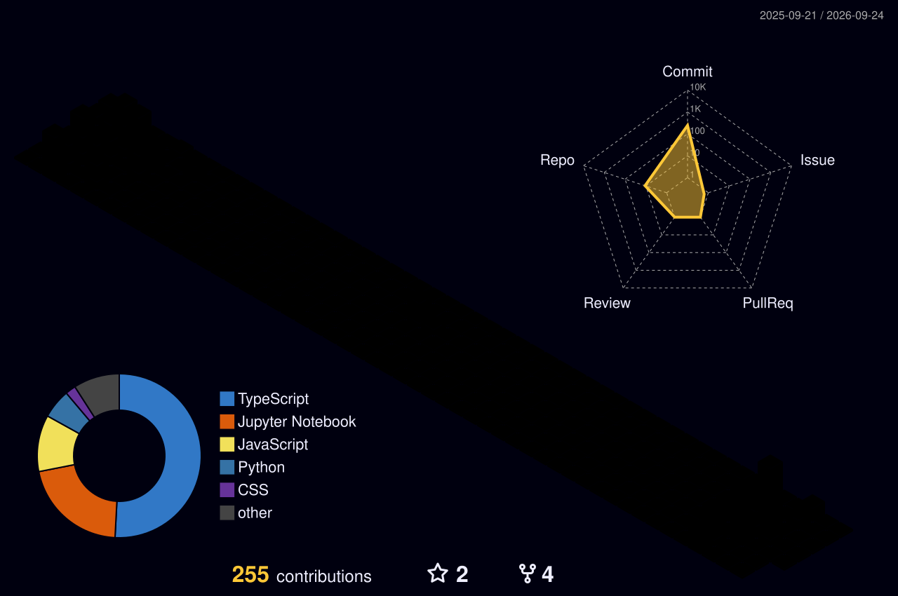

<div align="center">


<br/>

<a href="https://github.com/Dhanas3kar"></a>
<a href="https://www.linkedin.com/in/dhanasekar-murugesan-a9321731a/"></a>


</div>

<br/>

<!-- ─────────────────────────────── ABOUT ME ─────────────────────────────── -->

<div align="center">

## `⚡ whoami`

</div>

```yaml
name: Dhanasekar M.
role: Software Developer
location: Tamil Nadu, India
university: SRM Institute of Science and Technology, Trichy
degree: B.Tech Computer Science (Undergraduate)

interests:
  - Backend Architecture & API Design
  - AI / ML Pipelines & Data Engineering
  - System Design & Distributed Systems
  - Full-Stack Application Development

philosophy: >
  I build the systems behind the interface — the APIs that don't break,
  the pipelines that scale, and the architecture that holds up
  long after the demo is over.
```

<br/>

<!-- ─────────────────────────────── TECH STACK ─────────────────────────────── -->

<div align="center">

## `🛠️ stack`

<table>
  <tr>
    <td align="center" width="33%">
      <h4>💻 Languages</h4>
      
    </td>
    <td align="center" width="33%">
      <h4>⚙️ Backend & Web</h4>
      
    </td>
    <td align="center" width="33%">
      <h4>🗄️ Data</h4>
      
    </td>
  </tr>
  <tr>
    <td align="center" width="33%">
      <h4>🧠 AI / ML</h4>
      
    </td>
    <td align="center" width="33%">
      <h4>🏗️ Infra & DevOps</h4>
      
    </td>
    <td align="center" width="33%">
      <h4>📚 Currently Learning</h4>
      
    </td>
  </tr>
</table>

</div>

<br/>

<!-- ─────────────────────────────── PROJECTS ─────────────────────────────── -->

<div align="center">

## `📂 projects`

</div>

<table>
  <tr>
    <td width="50%">
      <h3 align="center">🎯 Hakiku</h3>
      <p align="center">
        <a href="https://github.com/Dhanas3kar/Hakiku"></a>
      </p>
      <p align="center">A full-stack app built around intelligent functionality — from backend services to database to UI, end to end.</p>
      <p align="center">
        
        
        
      </p>
    </td>
    <td width="50%">
      <h3 align="center">🛒 Thirumathi-Kart</h3>
      <p align="center">
        <a href="https://github.com/Rishinitt07/thirumathi_kart"></a>
      </p>
      <p align="center">Full-stack e-commerce platform with buyer/seller workflows, authentication, cart, and order management.</p>
      <p align="center">
        
        
        
      </p>
    </td>
  </tr>
  <tr>
    <td width="50%">
      <h3 align="center">✍️ Scribify AI</h3>
      <p align="center">
        
      </p>
      <p align="center">OCR + handwriting recognition pipeline feeding an LLM grader that scores and gives feedback on written answers.</p>
      <p align="center">
        
        
        
      </p>
    </td>
    <td width="50%">
      <h3 align="center">🔄 QuotAI Migration</h3>
      <p align="center">
        
      </p>
      <p align="center">Modular ETL pipeline for controlled transformation, validation, and reconciliation across data migrations.</p>
      <p align="center">
        
        
        
      </p>
    </td>
  </tr>
  <tr>
    <td width="50%" colspan="2">
      <h3 align="center">🛡️ CyberNeural IDS</h3>
      <p align="center">
        
      </p>
      <p align="center">Hybrid intrusion detection system combining autoencoder anomaly detection with CNN/LSTM classification for real-time network security.</p>
      <p align="center">
        
        
        
        
      </p>
    </td>
  </tr>
</table>

<br/>

<!-- ─────────────────────────────── TROPHIES ─────────────────────────────── -->

<div align="center">

## `🏆 achievements`


</div>

<br/>

<!-- ─────────────────────────────── GITHUB STATS ─────────────────────────────── -->

<div align="center">

## `📊 github stats`


<br/><br/>


<br/><br/>


</div>

<br/>

<!-- ─────────────────────────────── 3D CONTRIBUTION ─────────────────────────────── -->

<div align="center">

## `🧊 3D contribution map`

<picture>
  <source media="(prefers-color-scheme: dark)" srcset="./profile-3d-contrib/profile-night-rainbow.svg" />
  <source media="(prefers-color-scheme: light)" srcset="./profile-3d-contrib/profile-south-season-animate.svg" />
  
</picture>

</div>

<br/>

<!-- ─────────────────────────────── SNAKE ─────────────────────────────── -->

<div align="center">

## `🐍 contribution snake`

<picture>
  <source media="(prefers-color-scheme: dark)" srcset="https://raw.githubusercontent.com/Dhanas3kar/Dhanas3kar/output/github-contribution-grid-snake-dark.svg" />
  <source media="(prefers-color-scheme: light)" srcset="https://raw.githubusercontent.com/Dhanas3kar/Dhanas3kar/output/github-contribution-grid-snake.svg" />
  
</picture>

</div>

<br/>

<!-- ─────────────────────────────── CURRENTLY ─────────────────────────────── -->

<div align="center">

## `⚙️ currently`

</div>

```text
🔨 Building    →  AI-powered workflows & scalable backend systems
📚 Learning    →  Go deep dives · system design patterns · Kubernetes
🎯 Goal        →  Production-grade testing, observability, and CI/CD
🤝 Open to     →  Collaborations on backend / AI / data projects
```

<br/>

<!-- ─────────────────────────────── FOOTER ─────────────────────────────── -->

<div align="center">

### `💬 let's connect`

<a href="https://github.com/Dhanas3kar"></a>
<a href="https://www.linkedin.com/in/dhanasekar-murugesan-a9321731a/"></a>

<br/><br/>


<br/>


</div>
